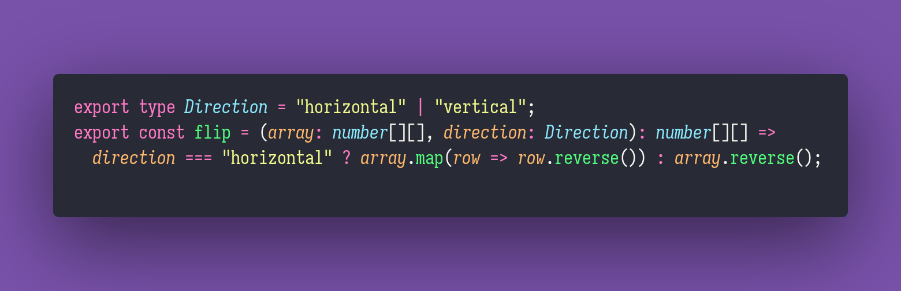

# Trees

Interview question of the [issue #336 of rendezvous with cassidoo](https://buttondown.email/cassidoo/archive/in-our-leisure-we-reveal-what-kind-of-people-we/).

## The Question

Write a data structure for a simple binary tree, and a function that prints a given tree.

### Example

```ts
let root = new Node(1);
    root.left = new Node(2);
    root.right = new Node(3);
    root.left.left = new Node(4);
    root.left.right = new Node(5);

> printTree(root)
> "
    1
   / \
  2   3
 / \
4   5
"
```

## Solution


